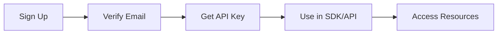
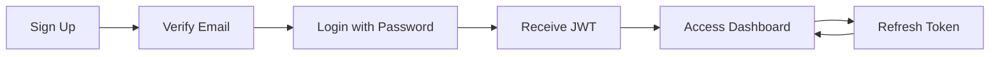

# Authentication Guide

FlowStack provides dual authentication methods for different use cases:

- **API Keys**: For SDK/API usage (persistent, never expire)
- **JWT Tokens**: For web dashboard access (session-based, 1 hour expiry)

## Getting Started

### 1. Sign Up

Register at [flowstack.fun](https://flowstack.fun):

```python
# Via API
import requests

response = requests.post(
    "https://api.flowstack.fun/customers",
    json={
        "email": "you@example.com",
        "name": "Your Name",
        "password": "securePassword123"  # Optional for dashboard access
    }
)

data = response.json()
# Returns:
# {
#   "customer_id": "uuid",
#   "api_key": "fs_your_api_key",
#   "message": "Account created! Please verify your email.",
#   "email_verification_required": true
# }
```

!!! important "Email Verification Required"
    You MUST verify your email before using FlowStack. Check your inbox for the verification link.

### 2. Email Verification

After signing up:
1. Check your email for verification link
2. Click the link to verify your account
3. Your API key and login will now work

## API Key Authentication

### For SDK Usage

API keys are used for programmatic access via the SDK:

```python
from flowstack import Agent

# Use your API key
agent = Agent(
    name="my-agent",
    api_key="fs_your_api_key_here"  # From signup
)

# Deploy and use your agent
endpoint = agent.deploy()
```

### For Direct API Calls

Include your API key in the `X-API-Key` header:

```bash
curl -X POST https://api.flowstack.fun/agents/my-agent/chat \
  -H "X-API-Key: fs_your_api_key_here" \
  -H "Content-Type: application/json" \
  -d '{"message": "Hello!"}'
```

### Regenerating API Keys

If your key is compromised:

```python
# Via API
response = requests.post(
    f"https://api.flowstack.fun/customers/{customer_id}/regenerate-key",
    headers={"X-API-Key": "fs_current_key"}
)

new_key = response.json()["api_key"]
```

## Dashboard Authentication (JWT)

### Login

For web dashboard access:

```javascript
// POST https://api.flowstack.fun/customers/login
const login = async (email, password) => {
  const response = await fetch('https://api.flowstack.fun/customers/login', {
    method: 'POST',
    headers: { 'Content-Type': 'application/json' },
    body: JSON.stringify({ email, password })
  });
  
  const data = await response.json();
  // Returns:
  // {
  //   "access_token": "eyJ...",  // JWT access token
  //   "refresh_token": "eyJ...", // For refreshing access
  //   "expires_in": 3600,        // 1 hour
  //   "customer": { ... }        // User info
  // }
  
  // Store tokens securely
  localStorage.setItem('access_token', data.access_token);
  localStorage.setItem('refresh_token', data.refresh_token);
  
  return data;
};
```

### Using JWT Tokens

Include the JWT in the Authorization header:

```javascript
const makeAuthenticatedRequest = async (endpoint, options = {}) => {
  const accessToken = localStorage.getItem('access_token');
  
  const response = await fetch(`https://api.flowstack.fun${endpoint}`, {
    ...options,
    headers: {
      ...options.headers,
      'Authorization': `Bearer ${accessToken}`,
      'Content-Type': 'application/json'
    }
  });
  
  return response;
};
```

### Refreshing Tokens

JWT tokens expire after 1 hour. Refresh them before expiry:

```javascript
// POST https://api.flowstack.fun/customers/refresh
const refreshAccessToken = async () => {
  const refreshToken = localStorage.getItem('refresh_token');
  
  const response = await fetch('https://api.flowstack.fun/customers/refresh', {
    method: 'POST',
    headers: { 'Content-Type': 'application/json' },
    body: JSON.stringify({ refresh_token: refreshToken })
  });
  
  const data = await response.json();
  // Returns new access_token
  
  localStorage.setItem('access_token', data.access_token);
  return data;
};
```

## Password Management

### Forgot Password

Initiate password reset:

```javascript
// POST https://api.flowstack.fun/customers/forgot-password
const forgotPassword = async (email) => {
  const response = await fetch('https://api.flowstack.fun/customers/forgot-password', {
    method: 'POST',
    headers: { 'Content-Type': 'application/json' },
    body: JSON.stringify({ email })
  });
  
  // User receives email with reset code
  return response.json();
};
```

### Reset Password

Complete reset with code from email:

```javascript
// POST https://api.flowstack.fun/customers/reset-password
const resetPassword = async (email, code, newPassword) => {
  const response = await fetch('https://api.flowstack.fun/customers/reset-password', {
    method: 'POST',
    headers: { 'Content-Type': 'application/json' },
    body: JSON.stringify({
      email,
      code,           // From email
      new_password: newPassword
    })
  });
  
  return response.json();
};
```

## Authentication Flows

### SDK/API Flow (API Key)



### Dashboard Flow (JWT)



## Security Best Practices

### API Key Security

!!! warning "Keep API Keys Secret"
    Never expose API keys in client-side code or public repositories.

```python
# ✅ GOOD: Use environment variables
import os
api_key = os.getenv('FLOWSTACK_API_KEY')

# ❌ BAD: Hardcoded keys
api_key = "fs_abc123..."  # Never do this!
```

### Token Storage

For web applications:

```javascript
// ✅ GOOD: Secure storage options
// Option 1: httpOnly cookies (most secure)
// Option 2: sessionStorage (clears on tab close)
// Option 3: localStorage with encryption

// ❌ BAD: Plain text in localStorage
localStorage.setItem('api_key', 'fs_abc123');  // Vulnerable to XSS
```

### CORS Configuration

FlowStack API supports CORS for approved origins:

```javascript
// Approved origins automatically get CORS headers
fetch('https://api.flowstack.fun/api/endpoint', {
  credentials: 'include',  // For cookies
  headers: {
    'X-API-Key': 'fs_...'  // Or Authorization header for JWT
  }
});
```

## Error Handling

### Common Authentication Errors

```python
# 401 Unauthorized
{
  "error": "Invalid API key or token expired"
}

# 403 Forbidden  
{
  "error": "Email verification required"
}

# 404 Not Found
{
  "error": "User not found"
}

# 429 Too Many Requests
{
  "error": "Rate limit exceeded. Try again later."
}
```

### Handling Errors

```python
import requests
from time import sleep

def make_authenticated_request(endpoint, api_key, retries=3):
    for attempt in range(retries):
        try:
            response = requests.get(
                f"https://api.flowstack.fun{endpoint}",
                headers={"X-API-Key": api_key}
            )
            
            if response.status_code == 200:
                return response.json()
            elif response.status_code == 401:
                raise Exception("Invalid API key")
            elif response.status_code == 403:
                raise Exception("Email verification required")
            elif response.status_code == 429:
                sleep(2 ** attempt)  # Exponential backoff
                continue
            else:
                response.raise_for_status()
                
        except requests.exceptions.RequestException as e:
            if attempt == retries - 1:
                raise
            sleep(1)
    
    return None
```

## React Implementation Example

Complete authentication context for React apps:

```jsx
import React, { createContext, useState, useContext, useEffect } from 'react';

const AuthContext = createContext();

export const useAuth = () => useContext(AuthContext);

export const AuthProvider = ({ children }) => {
  const [user, setUser] = useState(null);
  const [loading, setLoading] = useState(true);

  useEffect(() => {
    // Check for existing session
    const token = localStorage.getItem('access_token');
    if (token) {
      // Validate token and load user
      validateToken(token);
    }
    setLoading(false);
  }, []);

  const signup = async (email, name, password) => {
    const response = await fetch('https://api.flowstack.fun/customers', {
      method: 'POST',
      headers: { 'Content-Type': 'application/json' },
      body: JSON.stringify({ email, name, password })
    });
    
    const data = await response.json();
    localStorage.setItem('api_key', data.api_key);
    return data;
  };

  const login = async (email, password) => {
    const response = await fetch('https://api.flowstack.fun/customers/login', {
      method: 'POST',
      headers: { 'Content-Type': 'application/json' },
      body: JSON.stringify({ email, password })
    });
    
    const data = await response.json();
    
    // Store tokens
    localStorage.setItem('access_token', data.access_token);
    localStorage.setItem('refresh_token', data.refresh_token);
    
    setUser(data.customer);
    return data;
  };

  const logout = () => {
    localStorage.removeItem('access_token');
    localStorage.removeItem('refresh_token');
    setUser(null);
  };

  const refreshToken = async () => {
    const refresh = localStorage.getItem('refresh_token');
    
    const response = await fetch('https://api.flowstack.fun/customers/refresh', {
      method: 'POST',
      headers: { 'Content-Type': 'application/json' },
      body: JSON.stringify({ refresh_token: refresh })
    });
    
    const data = await response.json();
    localStorage.setItem('access_token', data.access_token);
    
    return data.access_token;
  };

  // Auto-refresh tokens before expiry
  useEffect(() => {
    const interval = setInterval(() => {
      const token = localStorage.getItem('access_token');
      if (token) {
        refreshToken();
      }
    }, 50 * 60 * 1000); // Refresh every 50 minutes
    
    return () => clearInterval(interval);
  }, []);

  return (
    <AuthContext.Provider value={{
      user,
      signup,
      login,
      logout,
      refreshToken,
      loading
    }}>
      {children}
    </AuthContext.Provider>
  );
};
```

## Migration for Existing Users

### Users Without Passwords

If you signed up before password support:

1. Request password reset
2. Check email for reset code
3. Set new password
4. Login with email/password

### Users With Unverified Emails

If you haven't verified your email:

1. Request new verification email
2. Click verification link
3. Your API key and login will work

## Summary

### Quick Reference

| Method | Use Case | Expiry | Header |
|--------|----------|--------|--------|
| API Key | SDK/API calls | Never | `X-API-Key: fs_...` |
| JWT Token | Dashboard/Web | 1 hour | `Authorization: Bearer eyJ...` |

### Key Points

1. **Email verification is mandatory** - Both auth methods require it
2. **API keys for programmatic access** - SDK, scripts, backend
3. **JWT tokens for web access** - Dashboard, frontend apps
4. **Passwords optional** - Only needed for dashboard login
5. **Secure storage required** - Never expose credentials

---

Need help? Check our [API reference](api-reference.md) or [contact support](https://flowstack.fun/support).