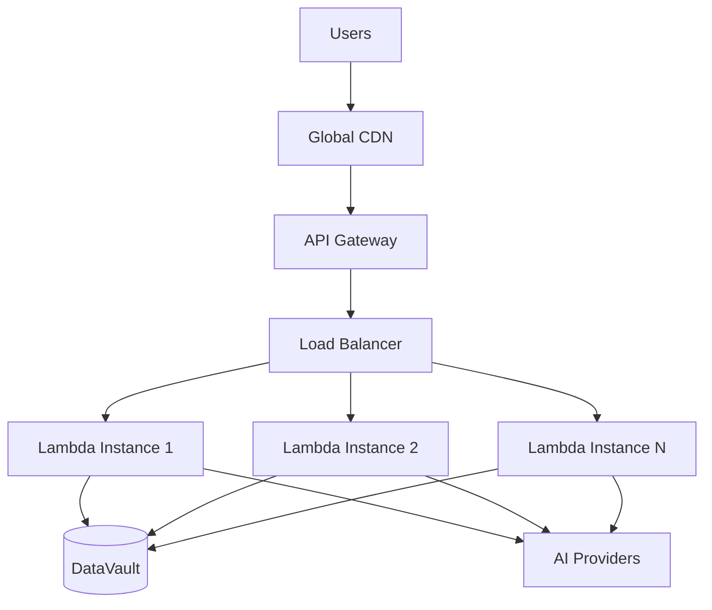

# Production Guide

Everything you need to know about running FlowStack agents in production environments.

## Production Architecture

When you deploy an agent, FlowStack creates a robust, scalable architecture:



## What's Included in Production

### Automatic Scaling

Your agent handles traffic spikes without configuration:

- **0 to 1000+ concurrent requests** - Automatic scaling
- **Global distribution** - Served from multiple regions
- **Load balancing** - Intelligent request routing
- **Cold start optimization** - Minimal startup latency

### Enterprise-Grade Security

Production deployments include comprehensive security:

- **API key authentication** - Secure access control
- **Request isolation** - Each request runs independently
- **Rate limiting** - Automatic abuse protection
- **HTTPS encryption** - All traffic encrypted
- **Network isolation** - Secure runtime environment

### Built-in Monitoring

Comprehensive observability out of the box:

- **Real-time metrics** - Response times, error rates, throughput
- **Error tracking** - Automatic error capture and alerting
- **Usage analytics** - Session tracking and billing metrics
- **Health monitoring** - Automatic health checks and recovery

### Data Persistence

DataVault provides enterprise-grade data storage:

- **MongoDB-backed** - Reliable, scalable database
- **Automatic backups** - Data protection and recovery
- **Encryption at rest** - Secure data storage
- **Namespaced isolation** - Your data stays separate

## Production Checklist

Before going live, ensure your agent is production-ready:

### ✅ Code Quality

- [ ] **Error handling** - All tools handle errors gracefully
- [ ] **Input validation** - Validate all user inputs
- [ ] **Type hints** - Use proper type annotations
- [ ] **Docstrings** - Document all tools and functions
- [ ] **Testing** - Test tools thoroughly before deployment

### ✅ Performance

- [ ] **Response time** - Tools complete within reasonable time
- [ ] **Memory usage** - Efficient memory management
- [ ] **Caching** - Cache expensive operations
- [ ] **Model selection** - Use appropriate models for tasks
- [ ] **Timeout handling** - Handle slow operations gracefully

### ✅ Security

- [ ] **API key protection** - Never expose API keys in code
- [ ] **Input sanitization** - Clean user inputs
- [ ] **Data validation** - Validate all data before processing
- [ ] **Error messages** - Don't expose sensitive information
- [ ] **Access control** - Implement proper authorization

### ✅ Monitoring

- [ ] **Health checks** - Verify agent responds correctly
- [ ] **Usage tracking** - Monitor session consumption
- [ ] **Error monitoring** - Track and handle errors
- [ ] **Performance monitoring** - Watch response times
- [ ] **Alerting setup** - Get notified of issues

## Performance Optimization

### Response Time Optimization

```python
from flowstack import Agent, Models

agent = Agent("optimized-agent", api_key="fs_...")

@agent.tool
def fast_operation(query: str) -> dict:
    """Optimized for speed"""
    
    # Check cache first
    cache_key = f"fast_{hash(query)}"
    cached = agent.vault.retrieve('cache', key=cache_key)
    
    if cached and not is_expired(cached):
        return {"result": cached['data'], "cached": True}
    
    # Use fastest model for simple queries
    if is_simple_query(query):
        agent.set_model(Models.CLAUDE_35_HAIKU)  # Fastest Claude model
    
    # Process and cache result
    result = process_query(query)
    agent.vault.store('cache', {
        'data': result,
        'expires_at': get_expiry_time()
    }, key=cache_key)
    
    return {"result": result, "cached": False}

def is_simple_query(query: str) -> bool:
    """Determine if query is simple enough for fast model"""
    simple_keywords = ['hello', 'help', 'what', 'how', 'basic']
    return any(keyword in query.lower() for keyword in simple_keywords)
```

### Memory Optimization

```python
@agent.tool
def memory_efficient_processing(data: list) -> dict:
    """Process large datasets efficiently"""
    
    # Process in chunks to avoid memory issues
    chunk_size = 100
    processed_count = 0
    
    for i in range(0, len(data), chunk_size):
        chunk = data[i:i + chunk_size]
        
        # Process chunk
        process_data_chunk(chunk)
        processed_count += len(chunk)
        
        # Optional: Store intermediate results
        if processed_count % 1000 == 0:
            save_checkpoint(processed_count)
    
    return {"processed": processed_count, "total": len(data)}
```

### Provider Optimization

```python
@agent.tool
def cost_optimized_request(task: str, complexity: str = "medium") -> dict:
    """Route to optimal provider based on task complexity"""
    
    if complexity == "simple":
        # Use cheapest option for simple tasks
        agent.set_provider("openai", byok={"api_key": "sk-..."})
        agent.set_model("gpt-3.5-turbo")
    elif complexity == "complex":
        # Use most capable model for complex tasks
        agent.set_provider("anthropic", byok={"api_key": "sk-ant-..."})
        agent.set_model("claude-3-opus-20240229")
    else:
        # Use balanced option for medium complexity
        agent.set_provider("bedrock")  # Managed
        agent.set_model(Models.CLAUDE_35_SONNET)
    
    response = agent.chat(task)
    return {"response": response, "provider": agent.provider, "model": agent.model}
```

## Error Handling & Recovery

### Robust Error Handling

```python
from flowstack import Agent, FlowStackError, QuotaExceededError
import logging

# Configure logging for production
logging.basicConfig(level=logging.INFO)
logger = logging.getLogger(__name__)

agent = Agent("production-agent", api_key="fs_...")

@agent.tool
def production_ready_tool(data: dict) -> dict:
    """Production-ready tool with comprehensive error handling"""
    
    try:
        # Validate inputs
        if not data or not isinstance(data, dict):
            return {"error": "Invalid input: data must be a non-empty dictionary"}
        
        required_fields = ['id', 'type']
        missing_fields = [field for field in required_fields if field not in data]
        if missing_fields:
            return {"error": f"Missing required fields: {missing_fields}"}
        
        # Process data
        result = process_business_logic(data)
        
        # Log success
        logger.info(f"Successfully processed data for ID: {data['id']}")
        
        return {"success": True, "result": result, "id": data['id']}
        
    except ValueError as e:
        logger.warning(f"Invalid data format: {e}")
        return {"error": "Invalid data format", "details": str(e), "retry": False}
        
    except ConnectionError as e:
        logger.error(f"External service unavailable: {e}")
        return {"error": "Service temporarily unavailable", "retry": True}
        
    except QuotaExceededError as e:
        logger.warning(f"Quota exceeded: {e}")
        return {"error": "Usage limit reached", "upgrade_required": True}
        
    except FlowStackError as e:
        logger.error(f"FlowStack error: {e}")
        return {"error": "Service error", "retry": True}
        
    except Exception as e:
        logger.error(f"Unexpected error: {e}", exc_info=True)
        return {"error": "Internal error", "retry": True}

def process_business_logic(data: dict) -> dict:
    """Your business logic here"""
    # Simulate processing
    return {"processed": True, "timestamp": "2024-01-15T10:30:00Z"}
```

### Graceful Degradation

```python
@agent.tool
def resilient_operation(query: str) -> dict:
    """Operation that gracefully degrades on failures"""
    
    try:
        # Try primary approach
        result = primary_processing_method(query)
        return {"result": result, "method": "primary", "quality": "high"}
        
    except Exception as e:
        logger.warning(f"Primary method failed: {e}")
        
        try:
            # Fallback to secondary approach
            result = secondary_processing_method(query)
            return {"result": result, "method": "secondary", "quality": "medium"}
            
        except Exception as e:
            logger.error(f"Secondary method failed: {e}")
            
            # Final fallback - basic response
            return {
                "result": "I'm experiencing technical difficulties. Please try again later.",
                "method": "fallback",
                "quality": "low",
                "error": True
            }
```

## Monitoring & Alerting

### Usage Monitoring

```python
@agent.tool
def monitor_usage() -> dict:
    """Monitor and alert on usage patterns"""
    
    usage = agent.get_usage()
    
    # Check for approaching limits
    if usage.usage_percentage > 90:
        send_alert("critical", f"Usage at {usage.usage_percentage}% - immediate action required")
    elif usage.usage_percentage > 80:
        send_alert("warning", f"Usage at {usage.usage_percentage}% - consider upgrading")
    
    # Track usage patterns
    agent.vault.store('usage_logs', {
        'timestamp': datetime.now().isoformat(),
        'sessions_used': usage.sessions_used,
        'sessions_limit': usage.sessions_limit,
        'usage_percentage': usage.usage_percentage
    })
    
    return {
        "current_usage": usage.usage_percentage,
        "sessions_remaining": usage.sessions_remaining,
        "status": "healthy" if usage.usage_percentage < 80 else "warning"
    }

def send_alert(level: str, message: str):
    """Send alert to monitoring system"""
    # Integrate with your alerting system (Slack, PagerDuty, etc.)
    logger.info(f"ALERT [{level}]: {message}")
```

### Health Monitoring

```python
@agent.tool
def health_check() -> dict:
    """Comprehensive health check"""
    
    health_status = {
        "status": "healthy",
        "checks": {},
        "timestamp": datetime.now().isoformat()
    }
    
    # Check DataVault connectivity
    try:
        agent.vault.store('health_check', {'test': True}, key='health_test')
        agent.vault.delete('health_check', 'health_test')
        health_status["checks"]["datavault"] = "healthy"
    except Exception as e:
        health_status["checks"]["datavault"] = f"unhealthy: {e}"
        health_status["status"] = "degraded"
    
    # Check AI provider connectivity
    try:
        test_response = agent.chat("test")
        if test_response:
            health_status["checks"]["ai_provider"] = "healthy"
        else:
            health_status["checks"]["ai_provider"] = "unhealthy: no response"
            health_status["status"] = "degraded"
    except Exception as e:
        health_status["checks"]["ai_provider"] = f"unhealthy: {e}"
        health_status["status"] = "unhealthy"
    
    # Check memory usage (if available)
    import psutil
    memory_percent = psutil.virtual_memory().percent
    if memory_percent > 90:
        health_status["checks"]["memory"] = f"warning: {memory_percent}% used"
        health_status["status"] = "degraded"
    else:
        health_status["checks"]["memory"] = f"healthy: {memory_percent}% used"
    
    return health_status
```

## Security Best Practices

### Input Validation

```python
import re
from typing import Union

@agent.tool
def secure_user_input(email: str, message: str) -> dict:
    """Securely handle user input"""
    
    # Validate email format
    email_pattern = r'^[a-zA-Z0-9._%+-]+@[a-zA-Z0-9.-]+\.[a-zA-Z]{2,}$'
    if not re.match(email_pattern, email):
        return {"error": "Invalid email format"}
    
    # Sanitize message
    message = sanitize_text(message)
    
    # Check message length
    if len(message) > 1000:
        return {"error": "Message too long (max 1000 characters)"}
    
    # Check for potentially harmful content
    if contains_harmful_content(message):
        return {"error": "Message contains inappropriate content"}
    
    # Process safe input
    return process_safe_input(email, message)

def sanitize_text(text: str) -> str:
    """Remove potentially harmful characters"""
    # Remove HTML tags
    import html
    text = html.escape(text)
    
    # Remove excessive whitespace
    text = ' '.join(text.split())
    
    return text

def contains_harmful_content(text: str) -> bool:
    """Check for harmful content patterns"""
    harmful_patterns = [
        r'<script.*?>.*?</script>',
        r'javascript:',
        r'vbscript:',
        r'onload\s*=',
        r'onerror\s*='
    ]
    
    for pattern in harmful_patterns:
        if re.search(pattern, text, re.IGNORECASE):
            return True
    
    return False
```

### API Key Security

```python
import os

# ✅ Good: Use environment variables
agent = Agent(
    name="secure-agent",
    api_key=os.getenv("FLOWSTACK_API_KEY"),
    provider="openai",
    byok={"api_key": os.getenv("OPENAI_API_KEY")}
)

# ❌ Bad: Hardcode API keys
# agent = Agent(
#     name="insecure-agent", 
#     api_key="fs_abc123...",  # Don't do this!
#     byok={"api_key": "sk-..."}  # Don't do this!
# )
```

### Data Protection

```python
@agent.tool
def protect_sensitive_data(user_data: dict) -> dict:
    """Handle sensitive data securely"""
    
    # Create a copy to avoid modifying original
    safe_data = user_data.copy()
    
    # Remove or mask sensitive fields
    sensitive_fields = ['ssn', 'credit_card', 'password', 'api_key']
    for field in sensitive_fields:
        if field in safe_data:
            if field == 'credit_card':
                # Mask credit card (show last 4 digits)
                safe_data[field] = f"****-****-****-{safe_data[field][-4:]}"
            else:
                # Remove other sensitive data
                del safe_data[field]
    
    # Log access for audit trail
    logger.info(f"Accessed user data for user: {safe_data.get('user_id', 'unknown')}")
    
    return {"data": safe_data, "sensitive_fields_removed": len(sensitive_fields)}
```

## Scaling Considerations

### High Traffic Handling

FlowStack automatically handles scaling, but you can optimize for high traffic:

```python
@agent.tool
def high_traffic_optimized(request_data: dict) -> dict:
    """Optimized for high-traffic scenarios"""
    
    # Use caching aggressively
    cache_key = generate_cache_key(request_data)
    cached_result = agent.vault.retrieve('high_traffic_cache', key=cache_key)
    
    if cached_result and not is_cache_expired(cached_result):
        return {"result": cached_result['data'], "cached": True}
    
    # Process with minimal resource usage
    result = lightweight_processing(request_data)
    
    # Cache with short TTL for high traffic
    agent.vault.store('high_traffic_cache', {
        'data': result,
        'expires_at': (datetime.now() + timedelta(minutes=5)).isoformat()
    }, key=cache_key)
    
    return {"result": result, "cached": False}

def generate_cache_key(data: dict) -> str:
    """Generate consistent cache key"""
    import hashlib
    key_data = json.dumps(data, sort_keys=True)
    return hashlib.md5(key_data.encode()).hexdigest()
```

### Resource Management

```python
@agent.tool
def resource_aware_processing(large_dataset: list) -> dict:
    """Process large datasets with resource awareness"""
    
    # Check current system load
    import psutil
    cpu_percent = psutil.cpu_percent()
    memory_percent = psutil.virtual_memory().percent
    
    # Adjust processing based on resource availability
    if cpu_percent > 80 or memory_percent > 80:
        # Use smaller chunks when resources are constrained
        chunk_size = 50
        delay_between_chunks = 0.1
    else:
        # Use larger chunks when resources are available
        chunk_size = 200
        delay_between_chunks = 0
    
    results = []
    for i in range(0, len(large_dataset), chunk_size):
        chunk = large_dataset[i:i + chunk_size]
        chunk_result = process_chunk(chunk)
        results.append(chunk_result)
        
        # Optional delay to prevent resource exhaustion
        if delay_between_chunks:
            time.sleep(delay_between_chunks)
    
    return {
        "processed_chunks": len(results),
        "total_items": len(large_dataset),
        "chunk_size_used": chunk_size
    }
```

## Deployment Strategies

### Blue-Green Deployment

```python
# Deploy new version alongside existing
new_endpoint = agent.deploy(version="2.0.0", strategy="blue_green")

# Test new version
if test_new_version(new_endpoint):
    # Switch traffic to new version
    agent.promote_deployment("2.0.0")
else:
    # Rollback to previous version
    agent.rollback_deployment()
```

### Canary Deployment

```python
# Deploy to small percentage of traffic
agent.deploy(
    version="2.0.0",
    strategy="canary",
    traffic_percentage=10  # 10% of traffic
)

# Monitor metrics and gradually increase traffic
if metrics_look_good():
    agent.increase_canary_traffic(50)  # 50% of traffic
    
    if still_looking_good():
        agent.promote_canary()  # 100% of traffic
```

## Cost Optimization

### Smart Provider Usage

```python
@agent.tool
def cost_optimized_routing(task: str, budget_per_session: float = 0.15) -> dict:
    """Route tasks to optimize costs while maintaining quality"""
    
    # Analyze task complexity
    complexity = analyze_task_complexity(task)
    
    if complexity == "simple" and budget_per_session <= 0.10:
        # Use cheapest option for simple tasks
        agent.set_provider("openai", byok={"api_key": os.getenv("OPENAI_KEY")})
        agent.set_model("gpt-3.5-turbo")
        estimated_cost = 0.05
    elif complexity == "medium" and budget_per_session <= 0.25:
        # Use managed Bedrock for balanced cost/performance
        agent.set_provider("bedrock")
        agent.set_model(Models.CLAUDE_35_SONNET)
        estimated_cost = 0.20
    elif complexity == "complex":
        # Use best model regardless of cost
        agent.set_provider("anthropic", byok={"api_key": os.getenv("ANTHROPIC_KEY")})
        agent.set_model("claude-3-opus-20240229")
        estimated_cost = 0.35
    else:
        return {"error": f"Task too expensive for budget of ${budget_per_session}"}
    
    response = agent.chat(task)
    
    # Track actual costs
    agent.vault.store('cost_tracking', {
        'task': task,
        'complexity': complexity,
        'provider': agent.provider,
        'model': agent.model,
        'estimated_cost': estimated_cost,
        'timestamp': datetime.now().isoformat()
    })
    
    return {
        "response": response,
        "estimated_cost": estimated_cost,
        "provider": agent.provider
    }
```

---

Ready for production? Start with our [deployment guide](deployment.md) or check the [billing documentation](billing.md) to understand costs.